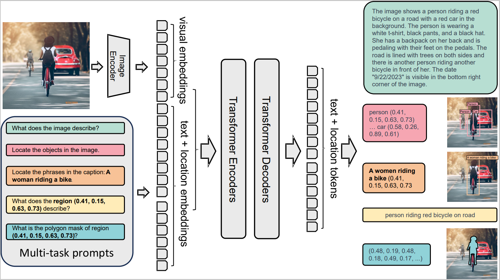

# MLDL_Project - **DocFloQA-FreezeTune**
This repository belongs to Kaibing Yang and focuses on fine-tuning multimodal models to adapt to specific tasks. Specically, the project finetunes the Florence-2 modle to better address the DocVQA problem.

In this project, we explored the related work of DocVQA and fine-tuned it on DocVQA2020 based on Florence-2 with satisfactory results

One prefix token + 80% tunable params ⇨ near-SOTA DocVQA.

A classic example of the DocVQA can 

# 1. Overview  

**DocFloQA-FreezeTune** shows that a large-scale vision–language model can
solve DocVQA without any task-specific layers.  We  

* prepend a single task prefix `<DocVQA>` to every question;  
* freeze (or selectively unfreeze) the Florence-2 visual encoder while fine-tuning the    language decoder;
* analyse four freezing ratios **0 / 33 / 66 / 100 %**.

# 2. Environment  

| component | version | note |
|-----------|---------|------|
| Python    | ≥ 3.9   | tested on 3.10 |
| PyTorch   | ≥ 2.1   | `pip install torch --index-url https://download.pytorch.org/whl/cu118` |
| CUDA      | 11.8 / 12.x | 1 × A100 (40 GB) / H100 (80 GB) |
| Transformers | ≥ 4.41 | `pip install transformers` |
| Datasets  | ≥ 2.19 | `pip install datasets` |
| seaborn | ≥ 0.11 | `pip install seaborn` |
| pandas | ≥ 1.3 | `pip install pandas` |

# 3. Dataset
For the fine-tuned dataset, we mainly used the DocVQA2020 dataset([link](https://huggingface.co/datasets/lmms-lab/DocVQA))

# 4. Model
For model selection, we chose the Florence-2 model due to the consideration of computational resources([link](https://huggingface.co/microsoft/Florence-2-base-ft/tree/main))

The model pipeline of the model is here.

The vector PDF is available in the under link.

# 5. Usage  

## 5.1 Install 
git clone https://github.com/KeibingYang/MLDL_Project.git

cd MLDL_Project

pip install -r requirements.txt

## Quick Start
Once you download the dataset and model already, you can run the follow instruction to finetune the Florence-2.

python finetune.py

There are four visual trainable ratios in the  freezing_levels and you can change the ratio as you need to achieve your goals. 
Once the code starts, it will train the given ration in the freezing_levels continuely and output the log and json in the given path.

There are some exapmle outputs like train_log_all_frozen_config.json, train_log_all_unfrozen_config.json and train_log_all frozen_config.json which are the configration during the training. There will be other logs and visualizations results after the all visual trainable ratios executing.

# 6. Results  

## 6.1 Fine-tuning curve (frozen all visual encoder - trainable ratio = 0)

| epoch | accuracy % | EM % | F1 % | val loss |
|------:|-----------:|-----:|-----:|---------:|
| 0 | 15.20 | 0.2437 | - | - | - |
| 1 | 36.20 | 0.5014 | 36.32 | 44.60 | 62.37 |
| 2 | 38.00 | 0.5164 | 38.83 | 47.37 | 59.66 |
| 3 | 40.20 | 0.5264 | 40.12 | 48.87 | 58.11 |
| 4 | 41.80 | 0.5449 | 40.74 | 49.50 | 57.97 |
| 5 | 43.20 | 0.5632 | 41.50 | 50.32 | 57.36 |
| 6 | 44.40 | 0.5670 | 42.14 | 50.99 | 57.11 |
| 7 | **45.80** | 0.5791 | 42.29 | 51.06 | **57.25** |
| 8 | 45.60 | **0.5816** | **42.40** | **51.13** | **57.25** |

  

## 6.2 Freezing ratio ablation (epoch 8)

| vision trainable | accuracy % | ANLS | EM % | F1 % | val loss |
|------------------|-----------:|------:|-----:|-----:|---------:|
| 0 % | 45.6 | 0.582 | 42.4 | 51.1 | 0.573 |
| 33 % | 49.3 | 0.602 | 46.7 | 55.2 | 0.557 |
| **66 %** | **51.1** | **0.611** | **48.1** | **56.8** | **0.553** |
| 100 % | 50.2 | 0.607 | 47.5 | 55.9 | 0.560 |

66 % selective unfreezing => best accuracy / stability trade-off.

---

Vector PDFs saved to `figures/`.

---

# 7. Limitations  

* Limited validation set: Evaluation conducted on only 500 samples → wide confidence intervals.

* Empirical freezing ratios: 0%/33%/66%/100% chosen intuitively rather than systematically optimized.

* Insufficient hyperparameter search: Limited exploration of learning rates, batch sizes, and training schedules.

* Noise robustness: Reduced performance on documents with OCR errors or image artifacts under frozen strategies.

* Domain generalization: Evaluation limited to DocVQA2020; cross-dataset performance unknown.

* Short training cycles: 0-8 epochs may not capture full convergence potential.

* Baseline comparisons: Missing comparisons with LoRA, adapters, and other PEFT methods.

# 8. Paper
Related results can be found in Submission/3022234232-杨凯冰-机器学习和深度学习-课程报告.pdf
